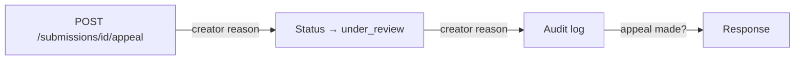

# Provenance Guard

Provenance Guard is a Flask service that classifies submitted creative writing as likely human-written, likely AI-generated, or uncertain, surfaces a transparency label with supporting evidence, logs every decision for audit, and lets creators appeal a classification they believe is wrong — without re-running the classifier.

The goal is attribution transparency, not policing creativity. A platform integrating this service gets a synchronous `POST /submit` pipeline: two complementary detection signals, a combined confidence score, a reader-facing label, and durable storage before the response goes back to the caller.

---

## Running locally

```bash
pip install -r requirements.txt
# Create .env with: GROQ_API_KEY=your_key_here
python app.py
```

The server starts on `http://127.0.0.1:5000`. Submissions are stored in `logs/submissions.db` (SQLite), created automatically on first submit. The database is gitignored — run `python scripts/seed_db.py` on a fresh clone to load demo rows and one sample appeal.

Run tests:

```bash
python -m pytest tests/ -q
```

---

## Architecture

### Submission flow


### Appeal flow



### Module layout

`app.py` is the only layer that talks to the classifier and storage. Clients never touch `submissions.db` or `appeals.jsonl` directly.

| Module | Responsibility |
|---|---|
| `classifier.py` | Thin orchestrator: runs both signals, returns combined result |
| `llm_classifier_signal.py` | LLM signal (`classify_llm`) + confidence combiner (`score_submission`) |
| `stylometric_classifier_signal.py` | Six feature sub-scorers, no API call |
| `labels.py` | `render_label` + `pick_driving_signal` — reader-facing text |
| `audit_log.py` | All reads/writes to SQLite + `appeals.jsonl` |

A submission enters through `POST /submit`, runs synchronously through both signals, gets combined into a single confidence score, mapped to a transparency label, written to the audit log, and returned. Appeals do **not** re-run classification — they record the creator's reasoning, flip `status` to `under_review`, and append to `appeals.jsonl`, leaving the original score and label untouched.

### Design decisions

**Why two signals instead of one?** A single detector always has a blind spot. The LLM signal catches polished, generic prose and mixed-authorship voice shifts, but can be fooled by context-aware style mimicry. The stylometric signal is fast, free, and deterministic, but can be gamed by injecting typos or varying sentence length. Running both and combining them means an attacker has to fool two detectors with different failure modes.

**Why asymmetric thresholds?** A false accusation of AI use is reputationally worse than a missed detection. `highly-AI` requires ≥ 80% confidence; `highly-human` only needs ≤ 25%. The wide `uncertain` band (26–79%) absorbs ambiguous cases rather than forcing a binary call.

**Why SQLite + JSONL instead of one store?** Submissions are the primary audit record (structured, queryable by label/status). Appeals are append-only events that reference a submission by `content_id`. Splitting them keeps the appeal log simple and immutable while submissions stay easy to filter.

**Why no auth layer?** Out of scope for this project. `creator_id` is a free-text field on submit; appeals are not verified against identity. A production deployment would gate appeals behind authentication.

---

## API

### `POST /submit`

Classify one piece of text. The only route that calls the Groq API; rate-limited (see below).

**Request:**
```json
{ "text": "the text to analyze", "creator_id": "optional, defaults to anonymous" }
```

**Response `201`:**
```json
{
  "content_id": "uuid",
  "creator_id": "alice",
  "submitted_at": "2026-07-06T12:00:00+00:00",
  "label": "highly-human | highly-AI | uncertain",
  "confidence": 0.1573,
  "note": null,
  "message": "full rendered label text",
  "llm_score": 0.1,
  "llm_reasoning": "short LLM explanation",
  "stylometric_score": 0.2147,
  "stylometric_explanation": "which features drove the score",
  "status": "final",
  "appeal": null
}
```

**Errors:** `400` if `text` is missing, empty/whitespace-only, or exceeds 20,000 characters; `429` if rate limit exceeded.

### `GET /submissions/<content_id>`

Fetch one stored submission. Same response shape as above; `appeal` is populated once filed.

**Errors:** `404` if id not found.

### `POST /submissions/<content_id>/appeal`

Contest a classification. Does not re-classify.

**Request:** `{ "reasoning": "why the label is wrong" }`

**Response `200`:**
```json
{
  "content_id": "uuid",
  "status": "under_review",
  "appeal": { "reasoning": "...", "filed_at": "ISO-8601" }
}
```

**Errors:** `404` unknown id; `400` empty reasoning; `409` appeal already filed (one per submission).

### `GET /log`

Audit log, newest first. Optional filters: `?status=under_review`, `?label=highly-AI`, `?limit=50`.

**Response `200`:**
```json
{ "count": 2, "entries": [ /* same shape as GET /submissions/<id> */ ] }
```

---

## Rate limiting

`POST /submit` is limited to **10 requests/minute and 100 requests/day per IP** (Flask-Limiter).

- **10/minute** covers a writer iterating on drafts in one sitting without blocking legitimate use, but stops tight-loop scripted abuse.
- **100/day** bounds sustained low-rate flooding. No single creator submits 100 pieces in a day; bulk workloads would be queued server-side in production.

Only `/submit` is limited — read routes hit local storage and do not call the LLM.

---

## Detection signals

Both signals output a float from 0.0 (definitely human) to 1.0 (definitely AI). Higher = more AI-like.

### Signal 1: LLM classifier (`llm_classifier_signal.py`)

**What it does:** Sends the submission to `llama-3.3-70b-versatile` via Groq with a structured system prompt containing class definitions, three few-shot examples (casual human rant, generic AI essay, mixed grandmother's soup paragraph), and instructions to judge stylistic flow — sentence structure, idea connection, tone consistency — before committing to a score. Temperature is 0.2 for reproducibility. The model returns JSON: `{"score": float, "reasoning": str}`.

**Why this signal?** LLMs are good at holistic stylistic judgment — they notice when one sentence in an otherwise personal essay suddenly sounds like a product brochure. That localized voice clash is exactly the `uncertain` case the spec describes, and it's hard to capture with word-count statistics alone.

**Why Groq + llama-3.3-70b?** Fast enough for synchronous `/submit`, capable enough for forensic-linguistics-style prompting, and cheap enough for a student project. In production I'd evaluate calibration across model versions and likely run classification async with a queue.

**Blind spots:** Context-aware personal-style mimicry (an LLM trained on someone's past writing). Text from a newer/stronger model than the classifier. The classifier only sees surface text, not edit history.

**Prompt-injection hardening:** Submissions are wrapped in `<<<SUBMISSION>>>` delimiters with explicit instructions to treat in-band "ignore your instructions" text as data to analyze, not commands to follow.

### Signal 2: Stylometric heuristics (`stylometric_classifier_signal.py`)

**What it does:** Computes six weighted sub-scores without any LLM call:

| Feature | What it measures | AI-leaning when… |
|---|---|---|
| Burstiness | Sentence-length variance (coefficient of variation) | Sentences are uniform length |
| Lexical diversity | Type-token ratio + density of known AI transition phrases | Low TTR, many "moreover"/"delve"/"it's important to note" hits |
| Punctuation regularity | Comma-rate consistency across sentences | Comma usage is eerily even |
| Structural symmetry | Paragraph length balance + enumerated lists | Paragraphs are evenly sized |
| Error signature | Spelling errors, grammar irregularities, informal markers | Prose is polished and error-free |
| Specificity | Generic filler vs. concrete details (numbers, names, possessives) | Generic abstractions, no idiosyncratic detail |

Sub-scores are combined with weights (lexical diversity and error signature weighted highest at 1.5× and 1.25× respectively) into one score plus a short explanation naming the top drivers.

**Why this signal?** It's free, deterministic, and fast — no API latency or cost per request. It catches the obvious AI tells (uniform structure, hedge phrases, zero typos in casual writing) that don't require semantic understanding. It also gives a concrete, inspectable feature breakdown for appeals, which a black-box LLM score alone does not.

**Why these six features specifically?** They map to documented statistical differences between human and AI text in the literature and in the project spec, and each is computable from raw text with no external dependencies beyond a spell-checker. I weighted lexical diversity and error signature higher because transition-phrase density and the presence/absence of natural writing noise are the most reliable discriminators in my Milestone 4 testing — burstiness alone misclassifies short texts.

**Blind spots:** Adversarial roughening (deliberate typos, varied sentence lengths added post-generation). Formulaic human genres that happen to look uniform (see Known limitations). ESL writing that uses formal connectors and clean grammar.

---

## Confidence scoring

### Formula

```
overall = 0.5 × llm_score + 0.5 × stylometric_score
```

Rounded to four decimal places, then mapped to labels:

| Label | Threshold | Meaning |
|---|---|---|
| `highly-human` | ≤ 0.25 (25%) | Strong human signals, no AI fingerprint |
| `uncertain` | > 0.25 and < 0.80 | Mixed or weak signals |
| `highly-AI` | ≥ 0.80 (80%) | AI fingerprints across most of the text |

### Why equal 0.5/0.5 weighting?

The stylometric signal's blind spot (cheap adversarial roughening) is easier to exploit than the LLM's (deep style mimicry requiring writing-history access). Weighting stylometrics higher would make the overall system easier to fool. Equal weighting is a conservative default; with real evaluation data I'd tune weights per signal's measured precision/recall.

### Why these thresholds?

The 25%/80% asymmetry implements the spec's false-positive cost model: more evidence is required to accuse than to clear. The 55-point-wide uncertain band prevents overconfident calls on mixed-authorship text.

### Boundary NOTE tags

Scores near a threshold get an appended NOTE (without changing the label):

- **70–85%** (`uncertain`/`highly-AI` boundary): warns the label might be a false positive; suggests filing an appeal with writing-process context.
- **20–30%** (`highly-human`/`uncertain` boundary): warns AI involvement cannot be fully ruled out.

### Example scores (Milestone 4 testing)

These use the curated test paragraphs from `tests/test_classify_stylometric.py`. LLM scores are the planning-doc few-shot reference values; stylometric scores are live computed values from `scripts/compare_signals.py`.

**High-confidence human — combined 10.5% (`highly-human`)**

> *"honestly idk how to start this but ok so yesterday my dog got into the trash AGAIN and istg he does it on purpose bcs he stares at me the whole time like daring me to stop him. anyways, i spent like 20 min cleaning it up and then found out he also chewed my charger. great. 10/10 would not recommend owning a golden retriever if you like having nice things lol"*

| Signal | Score | Driver |
|---|---|---|
| LLM | 0.05 | Irregular capitalization, casual abbreviations, concrete specific detail |
| Stylometric | 0.160 | Informal markers (`istg`, `bcs`, `honestly`); low structural symmetry |
| **Combined** | **0.105** | Both signals agree strongly human |

**High-confidence AI — combined 90.1% (`highly-AI`)**

> *"In today's fast-paced world, effective time management has become more important than ever. It is essential to prioritize tasks, set clear goals, and maintain a healthy work-life balance. By implementing these strategies, individuals can significantly boost their productivity and overall well-being. Ultimately, the key to success lies in consistent effort and mindful planning."*

| Signal | Score | Driver |
|---|---|---|
| LLM | 0.93 | Uniform structure, generic filler, safe hedging transitions |
| Stylometric | 0.872 | High burstiness (uniform = AI-like), polished error-free prose, high specificity (generic) |
| **Combined** | **0.901** | Both signals agree strongly AI |

The 79.6-point spread between these two (10.5% vs 90.1%) shows the scoring produces meaningful variation rather than clustering near 0.5. A third curated sample — the grandmother's soup paragraph with one AI-polished middle sentence — lands at **64.0% (`uncertain`)**, with the LLM at 0.55 and stylometric at 0.730, reflecting partial mixing rather than whole-text generation.

**Borderline: formal human writing — combined 64.6% (`uncertain`)**

> *"The relationship between monetary policy and asset price inflation has been extensively studied in the literature. Central banks face a fundamental tension between their mandate for price stability and the unintended consequences of prolonged low interest rates on equity and real estate valuations."*

| Signal | Score | Driver |
|---|---|---|
| LLM | 0.82 | Uniform polished structure, formal vocabulary, tidy organization — reads like heavily edited or generated academic prose |
| Stylometric | 0.472 | Polished error-free prose; high burstiness; low punctuation regularity |
| **Combined** | **0.646** | Signals disagree — LLM leans AI, stylometrics mid-range |

This is the ESL/formal-writing failure mode in action: a human economist writing in academic register scores 0.82 on the LLM signal because polished structure and formal connectors look AI-generated, even though stylometrics only reach 0.47. The combined score lands in `uncertain` rather than `highly-AI` (80%+) only because the stylometric signal pulls it back — but 64.6% is still uncomfortably high for genuine human prose.

**Borderline: lightly edited AI output — combined 39.5% (`uncertain`)**

> *"I've been thinking a lot about remote work lately. There are genuine tradeoffs — flexibility and no commute on one side, isolation and blurred work-life boundaries on the other. Studies show productivity varies widely by individual and role type."*

| Signal | Score | Driver |
|---|---|---|
| LLM | 0.40 | Casual personal opening and tradeoff framing read human; closing "Studies show…" sentence is generic and polished |
| Stylometric | 0.389 | Polished prose with no spelling or grammar irregularities detected |
| **Combined** | **0.395** | Both signals agree mid-range, human-leaning |

Light human editing of AI output (a conversational opener, an em dash) is enough to pull the score well below the `highly-AI` threshold. Both signals land near 0.39–0.40 and agree this is inconclusive rather than a clean AI call — which is the intended behavior for partial mixing, though a production system might want even more separation between this and clearly human casual writing (10.5%).

*Scores above are live runs through `classify_llm` + `classify_stylometric` + `score_submission` (Groq `llama-3.3-70b-versatile`, temperature 0.2). LLM scores may vary slightly between runs.*

### What I'd change for production

- Calibrate weights and thresholds on a labeled evaluation set rather than hand-picked examples.
- Run the LLM signal asynchronously with a job queue so `/submit` doesn't block on API latency.
- Add per-signal confidence intervals and surface signal disagreement explicitly ("LLM says human, stylometrics say AI").
- Log model version and prompt hash in the audit record for reproducibility.

---

## Transparency labels

Internal class names (`highly-human`, `highly-AI`, `uncertain`) are mapped to exact reader-facing strings by `labels.py`. Each label includes the confidence percentage. For `highly-human` and `uncertain`, a one-line "why" from the more decisive signal is appended. For `highly-AI`, the driving signal is interpolated into the main sentence. Boundary NOTE text is appended when applicable.

### `highly-human` (≤ 25%)

```
This content is **likely human-written**. Our analysis found the natural variation and irregularity 
typical of unassisted writing, with no strong AI fingerprint detected. Confidence: 16%. The text exhibits
highly human-like characteristics, such as irregular capitalization, casual abbreviations, 
and a conversational tone.
```

*(From seeded submission `e0898037-…`, casual dog-trash rant. LLM 0.10, stylometric 0.2147 → combined 0.1573.)*

### `highly-AI` (≥ 80%)

```
This content is **likely AI-generated**. Our analysis found strong AI fingerprints across most of the text,
including The text exhibits a highly uniform sentence structure, generic filler phrasing, and safe hedging transitions.
Confidence: 87%.
```

*(From seeded submission `243cbc70-…`, time-management essay. LLM 0.92, stylometric 0.8246 → combined 0.8723. The driving-signal phrase is the first sentence of the LLM's reasoning, trimmed to 140 characters.)*

### `uncertain` (> 25%, < 80%)

```
We're **not confident** whether this content is AI-generated or human-written. The analysis found a mix of
signals — some consistent with AI generation, some consistent with human writing — so we can't make a clean call.
Treat this classification as inconclusive. Confidence: 64%. high burstiness; polished prose with no spelling
or grammar irregularities detected.
```

*(Grandmother's soup paragraph with localized AI filler sentence. LLM 0.55, stylometric 0.730 → combined 0.640.)*

### Boundary example (74%, with NOTE)

```
We're **not confident** whether this content is AI-generated or human-written.The analysis found a mix of signals
— some consistent with AI generation, some consistent with human writing — so we can't make a clean call.
Treat this classification as inconclusive. Confidence: 74%. NOTE: This score is near the boundary between 'uncertain'
and 'likely AI-generated'. The classification might be a false positive. If you believe this is human-written,
file an appeal with a brief explanation of your writing process.
```

---

## Appeals workflow

1. Creator submits text → receives label + `content_id`.
2. If they disagree, `POST /submissions/<content_id>/appeal` with free-text `reasoning`.
3. System validates (exists, not already appealed), appends `{content_id, reasoning, filed_at}` to `logs/appeals.jsonl`, sets `status = "under_review"`.
4. Original score, signals, and label are **never modified**.
5. Reviewer queries `GET /log?status=under_review` to see the appeal queue with signal breakdowns, confidence, label, and appeal reasoning.

There is no `POST` endpoint to resolve appeals (`overturned` / `upheld`) — flagged as future work.

**Sample appeal** (seeded against the AI-flagged time-management essay):

```json
{
  "content_id": "243cbc70-7470-4c7e-86b9-cf9a1e8b063f",
  "reasoning": "I wrote this myself from personal experience. I am a non-native English speaker and my writing style may appear more formal than typical.",
  "filed_at": "2026-07-05T20:15:46.620950+00:00"
}
```

---

## Known limitations

**ESL / non-native English writing will be over-flagged as AI.** The stylometric signal treats formal transition phrases ("moreover," "in conclusion," "it is important to") and clean, classroom-learned grammar as AI tells. A second-language writer who defaults to safe connectors and produces error-free prose will score high on lexical diversity and error signature even when every word is their own. In Milestone 4 testing, the ESL sample scored stylometric **0.755** vs. casual human **0.160** — a 0.595 gap driven directly by those features, landing the ESL paragraph at **60.3% combined (`uncertain`)** despite being human-written. This is a property of measuring surface statistical patterns, not a lack of training data.

Other anticipated failure modes:

- **Formulaic creative writing** (children's poems, song lyrics with intentional repetition) — low burstiness and lexical diversity read as AI-like uniformity.
- **Structured genres** (changelogs, recipes, how-tos) — even paragraph lengths and template sentences trigger structural-symmetry flags.
- **Mixed authorship direction is invisible** — "human draft, AI-edited" and "AI draft, human-edited" can produce identical surface text; the system classifies the text, not the edit history.
- **No reviewer resolution endpoint** — appeals can be filed and queued but not formally accepted/denied through the API.

---

## Spec reflection

**How the spec guided implementation:** The asymmetric threshold design (80% to accuse, 25% to clear) and the boundary NOTE bands directly shaped `score_submission` in `llm_classifier_signal.py`. Without the spec's explicit false-positive cost model, I would have used symmetric 50% thresholds and a binary label — which would mislabel mixed-authorship text and over-accuse human writers near the boundary.

**Where implementation diverged:** The spec's appeal queue description says `GET /log` should return the original submission text so a reviewer can judge without re-reading blind. The implemented API response shape (`_to_response` in `app.py`) exposes signal scores, reasoning, label, and appeal data but does **not** include the `text` field — even though it is stored in `submissions.db`. I kept the slimmer response to match the documented JSON contract in the spec's API section (which also omits `text`), but a production reviewer UI would need either a `text` field on the log response or a separate content-fetch route.

A second divergence: the LLM system prompt adds prompt-injection hardening (`<<<SUBMISSION>>>` delimiters, explicit instruction to ignore in-band override attempts) that the spec did not call for. I added this after realizing `/submit` passes untrusted user text directly into the classifier prompt.

---

## AI usage

This project was built incrementally across three milestones using Cursor Agent. Two representative instances:

### 1. Stylometric feature implementation (Milestone 4)

**What I directed:** Implement `classify_stylometric` with the six named features from the spec (burstiness, lexical diversity, punctuation regularity, structural symmetry, error signature, specificity), each as a sub-scorer returning 0–1, combined with configurable weights, plus an explanation string naming the top drivers. Test against the three few-shot paragraphs from the LLM prompt plus an ESL sample.

**What it produced:** A full `stylometric_classifier_signal.py` with sub-scorers, an `analyze_error_signature` helper using `pyspellchecker`, AI transition phrase lists, and `FEATURE_WEIGHTS`. Tests in `test_classify_stylometric.py`.

**What I revised:** The initial error-signature scorer flagged proper nouns and sentence-initial capitals as spelling errors, inflating human-noise scores for formal text. I added `_is_spelling_exempt` with an informal allowlist (`idk`, `istg`, `lol`, etc.), proper-noun heuristics, and a `SUPPLEMENTARY_VALID_WORDS` set for domain terms the spell-checker missed. I also reweighted lexical diversity to lean more on transition-phrase density for short texts (< 80 words), because type-token ratio is unreliable on small samples.

### 2. Production layer — labels, audit log, appeals (Milestone 5)

**What I directed:** Build `labels.py` with verbatim label templates from the spec, `audit_log.py` with SQLite + JSONL storage, and the three remaining API routes (`GET /submissions/<id>`, `POST /appeal`, `GET /log`) per the documented request/response shapes. Verify all three label bands render distinct text and appeals don't mutate original scores.

**What it produced:** Complete `labels.py`, `audit_log.py`, route handlers in `app.py`, and integration tests in `test_app.py` with mocked `classify()` to hit each band deterministically.

**What I revised:** The agent initially stored appeals inside the SQLite row (updating the submission record). I overrode this to match the spec: appeals append to `appeals.jsonl` only, submission scores stay immutable, and `get_appeal` reads from the JSONL file at response time. I also caught an off-by-one in threshold comparisons (`confidence <= 0.25` for human, `confidence >= 0.80` for AI) during label-band testing and fixed the boundary tests to match.

---

## Portfolio walkthrough

Record a 2–3 minute screen recording following this script. Keep it unpolished — the goal is to show the system working and explain a few decisions out loud.

### Setup (before recording)

```bash
pip install -r requirements.txt
# .env with GROQ_API_KEY, or use seeded data only (no API key needed for steps 3–5)
python scripts/seed_db.py
python app.py
```

### Script (~2 minutes)

| Time | Show | Say |
|---|---|---|
| 0:00 | Terminal with `python app.py` running | "This is Provenance Guard — a Flask service that classifies creative writing as human, AI, or uncertain, and logs every decision." |
| 0:15 | `curl http://127.0.0.1:5000/log` (or browser/Postman) | "The audit log stores every submission with both signal scores. Here are two seeded examples — a casual human rant at 16% and a polished essay at 87%." |
| 0:35 | Point at `llm_score`, `stylometric_score`, `message` fields | "Two signals feed the score: an LLM classifier and stylometric heuristics, combined 50/50. The message is the exact transparency label the reader sees, with a confidence percentage and a one-line why." |
| 0:55 | `curl -X POST http://127.0.0.1:5000/submit -H "Content-Type: application/json" -d "{\"text\": \"honestly idk my dog ate my homework lol\", \"creator_id\": \"demo\"}"` | "Submit runs both signals synchronously, writes to the audit log, and returns the label. This casual text should land highly-human." *(Skip if no API key; point at the seeded human row instead.)* |
| 1:15 | `curl http://127.0.0.1:5000/log?status=under_review` | "When a creator disagrees, they appeal. This doesn't re-run the classifier — it records their reasoning and flips status to under_review. The original 87% AI score stays untouched." |
| 1:30 | Open `classifier.py` or architecture diagram in README | "I used asymmetric thresholds — 80% to call something AI, only 25% to clear it as human — because a false accusation is worse than a miss. The wide uncertain band catches mixed-authorship cases." |
| 1:50 | Open `stylometric_classifier_signal.py`, scroll to `FEATURE_SUBSCORERS` | "The stylometric signal is six cheap features — burstiness, lexical diversity, error signature, and so on. It's complementary to the LLM because each signal has different blind spots." |
| 2:05 | Wrap up | "Known limitation: ESL writing gets over-flagged because formal connectors and clean grammar look AI-like to the stylometric features. Appeals and the audit log are how a human reviewer would catch that." |

### Recording tips

- Windows: Xbox Game Bar (`Win + G`) or OBS.
- Mac: QuickTime → New Screen Recording.
- Show terminal output large enough to read; you don't need to show every line of code.

**Submit your recording** as a link (YouTube unlisted, Loom, Google Drive, etc.) in your portfolio submission alongside this repo.

---

## Project structure

```
app.py                          # Flask routes
classifier.py                   # classify() orchestrator
llm_classifier_signal.py        # LLM signal + score_submission
stylometric_classifier_signal.py # Stylometric signal
labels.py                       # Label rendering
audit_log.py                    # SQLite + appeals JSONL
scripts/
  compare_signals.py            # Compare signals on curated inputs
  seed_db.py                    # Seed demo data
tests/                          # pytest suite (60 tests)
logs/
  submissions.db                # gitignored, created at runtime
  appeals.jsonl                 # appeal records
planning.md                     # Original design spec
```
