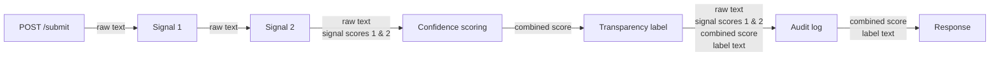
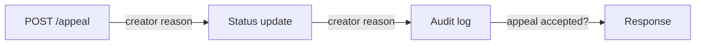

# Provenance guard

---

Platforms where people share original writing are running into a new problem: there's no good way to tell whether a submission was actually written by the person posting it, or generated by AI and passed off as their own. The goal isn't to police creativity, it's to protect attribution and give readers the context they need to judge what they're looking at.

Provenance Guard is a system built to solve this. Any creative sharing platform could plug it in to take a piece of submitted content, run it through a classifier, score how confident that classification is, and surface a transparency label back to the user. Creators who feel like they got misclassified can also file an appeal, which gets logged and can eventually feed back into how future submissions are judged.

---

## Architecture

---

### Submission flow



### Appeal flow



### Narrative

A submission enters through `POST /submit`, runs synchronously through both classification signals, gets combined into a single confidence score, mapped to a transparency label, and written to the audit log before the label and score are returned to the caller. If a creator disagrees with the label they received, `POST /submissions/<id>/appeal` does **not** re-run classification — it only records their reasoning, flips the submission's status to `under_review`, and appends an entry to the audit log, leaving the original score and label untouched pending human review.

---

## Classification Methodology

---

### Labels

---

#### `highly-human`
This label means that the post is very likely (<= 25% overall confidence score) to be entirely human-written. The text displays the typical patterns of writing with zero AI involvement in producing any part of the text itself — it feels natural, with the kind of irregular grammar, punctuation, and spelling mistakes that come from a person, not a model.
This label does not exclude AI being used to come up with the *idea* for the piece. The author may have started from an LLM-suggested premise and then written every sentence themselves — no AI ever touched the text.

#### `highly-AI`
This label means that the post is very likely (>= 80% overall confidence score) to be substantially AI-written. The text displays the typical patterns of AI generation across most of the piece: sentence-level phrasing, structure, and word choice throughout the text bear the model's fingerprint, even if the underlying ideas originated with the author.
This label also covers **thorough AI polishing of a human draft** — cases where the author wrote the original text, then had an LLM do a comprehensive pass across the whole piece (rewriting most sentences for grammar, word choice, or coherence) without changing the theme. Because that kind of pass touches nearly every sentence, it produces the same *surface* signal as full generation, which is why it still scores in this band. Contrast this with `uncertain`, below, where AI touches only *part* of the text.

#### `uncertain`
This label means the text doesn't cleanly match the profile of either `highly-human` or `highly-AI` (> 25%, < 80% overall confidence score) — either because it shows a mix of signals, or because it shows too few strong signals of either to call.
This is the label for **partial / localized mixing**: only some sentences or sections carry an AI or human fingerprint while the rest doesn't. Two examples: an original human-written piece where the author asked an LLM to rewrite one weak paragraph, leaving the rest untouched; or an AI-drafted piece where the author manually rewrote the opening and closing by hand. In both cases, only *part* of the text was touched by the other source, which is what distinguishes this from the whole-text AI polish described under `highly-AI`.

> **Note on scope, not just degree:** the `highly-AI` polish case and the `uncertain` partial-edit case are told apart by *coverage* — how much of the text was touched by AI — not by vague adjectives like "many parts" vs. "certain parts." A pass that rewrites most sentences reads as `highly-AI`; a pass confined to a subsection reads as `uncertain`.
>
> **Known blind spot:** neither signal can currently tell *direction* — "human draft, AI-edited" and "AI draft, human-edited" can produce statistically identical surface text. The system classifies based on the text's surface characteristics only, not on provenance history, so these two authorship paths are indistinguishable to it by design.

---

### Displayed label text

The class names above (`highly-human`, `highly-AI`, `uncertain`) are internal identifiers, not what a reader sees. The UI renders one of these three exact strings, chosen by which confidence band the score falls into. Boundary-band scores (70-85%, 20-30%) append the NOTE sentence described under "Handling grey-areas" to the same label text.

- **`highly-AI` (>= 80%)**
  > "This content is **likely AI-generated**. Our analysis found strong AI fingerprints across most of the text, including [driving signal, e.g. uniform sentence structure and heavy use of common AI phrasing]."

- **`highly-human` (<= 25%)**
  > "This content is **likely human-written**. Our analysis found the natural variation and irregularity typical of unassisted writing, with no strong AI fingerprint detected."

- **`uncertain` (> 25%, < 80%)**
  > "We're **not confident** whether this content is AI-generated or human-written. The analysis found a mix of signals — some consistent with AI generation, some consistent with human writing — so we can't make a clean call. Treat this classification as inconclusive."

Each rendered label is followed by the numeric confidence score and a one-line "why" pulled from the signals' explanations, so a reader never sees a bare label with no supporting evidence.

---

### Classification Signals

---

#### LLM-based classification signal

This signal will prompt llama-3.3-70b-versatile through the Groq API (get API key via .env) to ask the LLM to classify the text submission in 1 of the 3 classes mentioned above. The LLM will be given a carefully structured system prompt to guide this classification. The prompt should include the class definitions, a couple of few-shot examples of each class so the LLM has a concrete reference for what "highly-human," "highly-AI," and "uncertain" actually look like, and instructions to look at the stylistic choices and flow of information within the text to inform its classification, rather than just vibes.

**Output: a floating point number from 0 to 1**.

The prompt should also walk the LLM through its reasoning before committing to a label, basically asking it to think out loud on things like whether the sentence structure feels natural or too polished, whether ideas connect the way a person's train of thought would, and whether the tone stays consistent throughout, before landing on a confidence score. This reasoning is also what gets surfaced back as the explanation for the CLF layer, so it should be short and specific enough that a user reading it in an appeal can actually understand why they got flagged. Temperature should be kept low so the same submission doesn't get wildly different scores on separate runs.

The blind spot for this signal is AI-generated text that is very specifically tailored to a person's writing. This text is generated via an LLM with good context of a person's past manual writing, and is thus able to generate a piece of writing that sounds human. It can even deliberately include grammatical and spelling errors in adversarial cases. Another blind spot is that the LLM doing the classifying (llama-3.3-70b) might just be worse at detecting text written by a stronger or newer model than itself, since it has less to go on for what that model's typical patterns look like.

#### Stylometric heuristics signal

This signal scores the text submission using a set of lightweight, computable writing-style features known to statistically differ between human and AI-generated text, without relying on any LLM call. 

**Output: a floating point number from 0 to 1**.

Features include:

- **Burstiness**: variance in sentence length and structure. Human writing tends to alternate between short and long, simple and complex sentences; AI writing tends toward more uniform sentence lengths.
- **Lexical diversity**: type-token ratio and repetition patterns. AI text often over-relies on a narrow set of "safe" transition and hedging phrases (e.g. "moreover," "it's important to note," "in conclusion," "delve," "tapestry," "underscore," "boast," "landscape").
- **Punctuation regularity**: consistency of comma/semicolon usage across sentences. Human writing shows more irregular punctuation discipline, especially in informal contexts.
- **Structural symmetry**: paragraph length balance and use of enumerated lists/bullets. AI text tends to produce suspiciously tidy, evenly-balanced structure even when not prompted to.
- **Error signature**: presence/absence and type of typos, spelling inconsistencies, and grammatical irregularities. Human text has a "natural noise" profile; clean, error-free text (in casual contexts) skews toward the AI class.
- **Specificity**: presence of concrete, idiosyncratic personal details (names, dates, references) vs. generic filler examples, which AI defaults to absent specific prompting.

Each feature produces a sub-score, which are combined into an overall confidence score for this signal, plus a short explanation of which features drove the score (e.g. "low sentence-length variance, high use of formal transition phrases").

The blind spot for this signal is adversarial post-processing: text that was AI-generated and then deliberately "roughened" (typos injected, sentence lengths varied, casual phrasing added) either by a human editor or by explicit prompting of the LLM to mimic a specific person's style. Because this signal only measures surface statistical patterns, it can be fooled by these tweaks even though the LLM-based signal's blind spot (context-aware personal-style mimicry) may catch different cases — the two signals are intended to be complementary.

---

### Overall classification score formula

$$
  \text{Overall Classification Score} = 0.5 * l + 0.5 * s
$$
With $l$ as the **LLM-based classification signal** and $s$ as the **Stylometric heuristics signal**. The **Overall Classification Score** is between 0 and 1, acting as the confidence score of the classification process.

> **Why 0.5/0.5:** the two signals have blind spots of different severity, not just different kinds. The stylometric signal's blind spot (adversarial "roughening" — injected typos, varied sentence length) is a cheap, low-effort attack. The LLM signal's blind spot (deep, context-aware personal-style mimicry) requires much more effort and access to a person's writing history. Weighting the more-easily-gamed signal higher would make the system easier to fool overall, so the two are weighted equally by default rather than skewed toward stylometrics. This should be revisited once real evaluation data on each signal's standalone accuracy is available.

---

### Handling grey-areas

The system should treat false positives — human-written content mislabeled `highly-AI` — as more costly than false negatives — AI-written content mislabeled `highly-human`. A false accusation of AI use is reputationally damaging to a creator in a way that a missed detection is not, so the system should be biased toward under-flagging rather than over-flagging.

That asymmetry is implemented two ways:

1. **Asymmetric thresholds.** `highly-AI` requires a higher bar (>= 80%) than the mirror-image confidence needed for `highly-human` (<= 25%). This means the system needs more evidence before it will accuse a submission of being AI-written than it does before clearing it as human.
2. **Boundary NOTE tags.** The `uncertain` class absorbs most ambiguous cases, but scores near either threshold still carry a real risk of being wrong. In these boundary bands, the label is accompanied by a NOTE flagging that the classification is unusually uncertain given the specific nuances of the text:
   - **70%-85%** (straddling the `uncertain` / `highly-AI` boundary at 80%): the note tells the creator the label might be a false positive, and instructs them to write a brief explanation of their writing process to support an appeal — since this is the higher-cost error the system is trying to protect against.
   - **20%-30%** (straddling the `uncertain` / `highly-human` boundary at 25%): the note flags that AI involvement can't be ruled out despite the human-leaning score, for the reader's context. This band doesn't carry the same appeal instructions, since a creator is not harmed by being under-flagged — but the note still surfaces the uncertainty rather than presenting the score as settled.

Note also the blind spot called out under `uncertain` above: the signals classify based on surface text characteristics, not edit history, so they cannot distinguish "human draft, AI-edited" from "AI draft, human-edited." Boundary cases involving either kind of mixed authorship are exactly where NOTE tags matter most.

---

### Appeals workflow

**Who can appeal:** the original submitter (identified by the `author` field on the submission — for this project's scope there's no auth layer). One appeal per submission; a second attempt gets a `409`.

**What they provide:** free-text `reasoning` explaining why they believe the label is wrong — e.g. describing their actual writing process, or context the classifier couldn't see (drafting history, native-language influence on phrasing, deliberate stylistic choices).

**What the system does on receipt:**

1. Validates the submission exists and hasn't already been appealed.
2. Appends `{submission_id, reasoning, filed_at}` to `appeals.jsonl` — the original score, signals, and label are never modified or recomputed.
3. Updates `status` from `final` to `under_review` on the matching row in `submissions.db`.
4. Returns the new status and the appeal record to the caller as confirmation.

No automatic re-classification happens; a status of `under_review` is a signal for a human to look, not a verdict change.

**What a human reviewer sees in the appeal queue:** hitting `GET /log?status=under_review` returns, newest first, every submission currently under appeal with the full record needed to make a call without re-reading the raw text blind:

- the original text, author, and submission timestamp
- both signal scores and their explanations (LLM reasoning + stylometric feature breakdown)
- the combined confidence score and the label/NOTE that was shown to the creator
- the creator's appeal reasoning and when it was filed

This project's scope does not include a `POST` endpoint for a reviewer to resolve an appeal (accept/deny) — that's flagged as a known gap, not an oversight, since resolving an appeal would need its own status value (e.g. `overturned` / `upheld`) and audit trail, which is future work beyond `under_review`.

---

### Anticipated edge cases

The system is expected to handle these cases poorly, and both are surface-level statistical confusions rather than generic "detection is imperfect" caveats:

1. **Simple, repetitive, formulaic creative writing (e.g. a children's poem or a lyric with intentional repetition).** The stylometric signal's burstiness and lexical-diversity features look for sentence-length variance and low repetition as human markers. A poem that deliberately repeats a refrain, uses simple short sentences, and stays within a narrow vocabulary on purpose will score its structural-symmetry and lexical-diversity features in the AI-leaning direction, even though the uniformity is a stylistic choice, not a generation artifact.
2. **Non-native or ESL English writing with simplified grammar and a narrow set of "safe" transition words.** Someone writing in a second language often defaults to the same small set of connectors the stylometric signal flags as an AI tell ("moreover," "in conclusion," "it is important to"), and may also produce cleaner, less erratic punctuation than a native speaker's casual writing, because they learned formal written English in a classroom. This is a case where the "error signature" and "lexical diversity" features actively work against a legitimate human author.
3. **Heavily technical or reference-style writing (e.g. a changelog, a recipe, or a structured how-to).** These genres are naturally uniform in structure (numbered steps, consistent sentence templates, minimal idiosyncratic detail) for reasons that have nothing to do with authorship — the structural-symmetry and specificity features will read this as AI-like regardless of who wrote it.

---

### APIs

`app.py` exposes four routes. `APP` is the only layer that talks to `CLF` and to storage — a client never touches `submissions.db` or `appeals.jsonl` directly.

---

#### `POST /submit`

Accepts one piece of content for attribution analysis and runs it through `CLF` synchronously. This is the only route that calls the LLM signal, so it's the one that gets rate-limited.

Request:

```json
{
  "content": "the text to analyze",
  "author": "optional, defaults to \"anonymous\""
}
```

Response `201`:

```json
{
  "submission_id": "uuid",
  "submitted_at": "ISO-8601 timestamp",
  "label": "highly-human | highly-AI | uncertain",
  "confidence": 0.0,
  "note": "string, present only for boundary cases (70-85% / 20-30%), otherwise null",
  "signals": {
    "llm": { "score": 0.0, "reasoning": "short explanation from the LLM's reasoning step" },
    "stylometric": { "score": 0.0, "explanation": "which features drove the score" }
  },
  "status": "final | under_review"
}
```

Errors: `400` if `content` is missing/empty or exceeds a max length; `429` if the rate limit is exceeded.

#### `GET /submissions/<submission_id>`

Fetches one stored record from `submissions.db`, including its current `status` and any appeal already filed. Used by the UI to re-render a result page, and by a creator before deciding whether to appeal.

Response `200`: same shape as the `POST /submit` response, plus an `appeal` field (`null` if none has been filed).

Errors: `404` if the id doesn't exist.

#### `POST /submissions/<submission_id>/appeal`

Lets a creator contest a classification. Does **not** re-run `CLF` — this only captures reasoning and flips status.

Request:

```json
{ "reasoning": "why the creator believes the label is wrong" }
```

Effect: appends `{submission_id, reasoning, filed_at}` to `appeals.jsonl`, and updates the matching row in `submissions.db` to `status = "under_review"`.

Response `200`:

```json
{
  "submission_id": "uuid",
  "status": "under_review",
  "appeal": { "reasoning": "...", "filed_at": "ISO-8601 timestamp" }
}
```

Errors: `404` if the id doesn't exist; `400` if `reasoning` is missing/empty; `409` if an appeal has already been filed for this submission (one appeal per submission, no re-appeals).

#### `GET /log`

Reads the audit log — every decision `CLF` has made, joined with any appeal from `appeals.jsonl`. This is the grading/inspection surface: it must make signals, confidence, and appeal history visible, not just the final label.

Optional query params: `?status=under_review`, `?label=highly-AI`, `?limit=50`.

Response `200`:

```json
{
  "count": 3,
  "entries": [ /* same shape as GET /submissions/<id>, one per submission, newest first */ ]
}
```

---

## AI Tool Plan

---

### M3 — Submission endpoint + first signal

**Spec sections to hand over:** "Classification Signals" (the LLM-based signal subsection specifically), "Architecture" (both diagrams + narrative), and the `POST /submit` API contract.

**What to ask for:** a Flask app skeleton (`app.py`) wiring up the `/submit` route with request validation per the documented `400`/`429` errors, plus a standalone `classify_llm(text: str) -> dict` function in `classifier.py` that calls the Groq API with the prompt structure described (class definitions, few-shot examples, reasoning-before-score, low temperature) and returns `{"score": float, "reasoning": str}`.

**How to verify:** call `classify_llm()` directly from a REPL/small script on 3-4 hand-picked inputs before wiring it into the endpoint — one obviously AI-generated paragraph, one obviously human (e.g. a casual message with typos), and one edited/mixed sample. Confirm scores land in the expected direction and `reasoning` is legible, *before* trusting it inside the route. Only once that's solid, hit `/submit` with `curl`/Postman and check the response shape matches the documented contract exactly (status codes included).

---

### M4 — Second signal + confidence scoring

**Spec sections to hand over:** "Classification Signals" (the stylometric heuristics subsection), "Uncertainty Representation" (the score formula + "Handling grey-areas" asymmetric-threshold section), and the "Architecture" diagram.

**What to ask for:** a `classify_stylometric(text: str) -> dict` function implementing the six named features (burstiness, lexical diversity, punctuation regularity, structural symmetry, error signature, specificity) as sub-scores combined into one `{"score": float, "explanation": str}`, plus a `score_submission(llm_result, stylometric_result) -> dict` function implementing the `0.5*l + 0.5*s` formula, the `highly-human`/`uncertain`/`highly-AI` threshold mapping, and the 70-85%/20-30% boundary NOTE logic.

**How to verify:** run `classify_stylometric()` and `score_submission()` on the same test inputs from M3 plus a few new ones (a repetitive poem, an ESL-style paragraph) *before* wiring into `/submit`. Confirm: (1) scores vary meaningfully between the clearly-AI and clearly-human samples rather than clustering near 0.5; (2) a boundary-adjacent input (deliberately constructed to land near 70-85% or 20-30%) actually triggers the NOTE text; (3) the two signals sometimes disagree on the edge cases, which is expected and confirms they're capturing different things rather than duplicating one signal.

---

### M5 — Production layer (labels + appeals)

**Spec sections to hand over:** "Displayed label text" (all three exact strings), "Appeals workflow", "Architecture" (appeal flow diagram + narrative), and the `POST /submissions/<id>/appeal` + `GET /log` API contracts.

**What to ask for:** a `render_label(label, confidence, note) -> str` function that fills in the three label templates verbatim (not paraphrased) with the driving-signal explanation interpolated in; the `GET /submissions/<id>` and `POST /submissions/<id>/appeal` routes per the documented request/response/error shapes; and the `GET /log` route with its `status`/`label`/`limit` query filters reading from `submissions.db` joined with `appeals.jsonl`.

**How to verify:** construct three synthetic submissions whose scores are hand-set (mock the signal functions or insert rows directly) to land in each of the three bands, and confirm `GET /submissions/<id>` renders the correct exact label text for all three — this is the one place a subtle bug (wrong threshold comparison, off-by-one on `>=` vs `>`) would silently ship the wrong label. Then file an appeal against one of them and confirm: `status` flips to `under_review`, the appeal is queryable via `GET /log?status=under_review`, a second appeal attempt on the same id returns `409`, and the original score/label are untouched.

---
